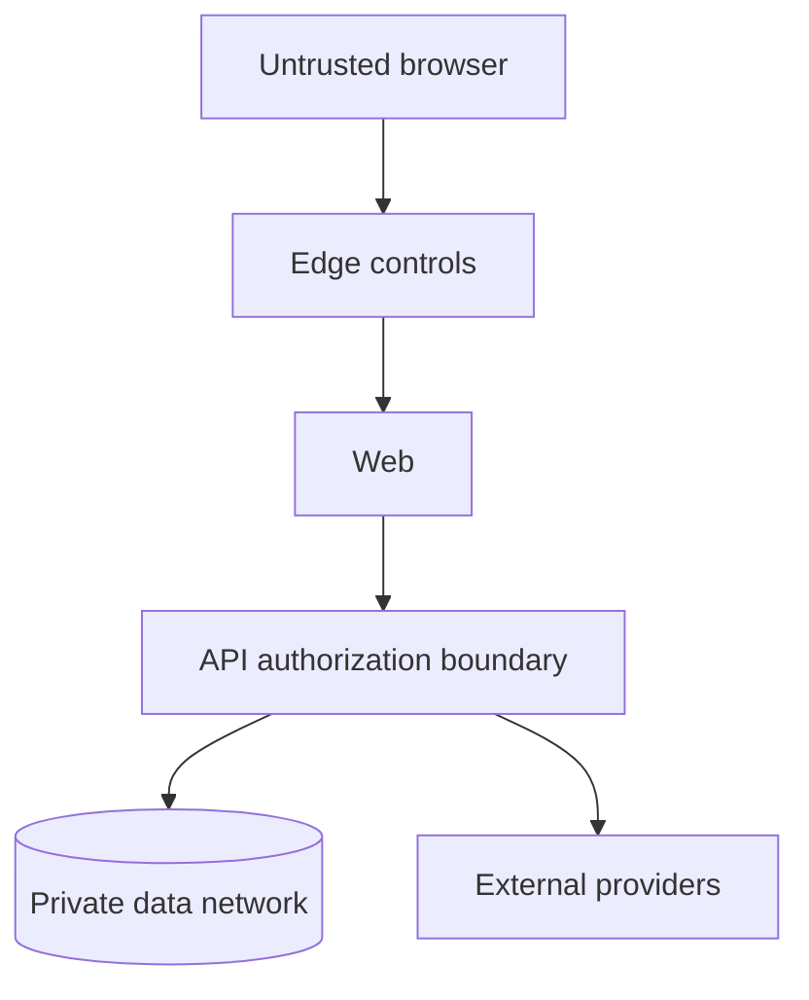

# V1 Security Architecture

- **Owner:** Architecture Owner
- **Status:** In Review
- **Version:** 0.2
- **Last Updated:** 2026-07-25

**Revision Note (0.2):** Governing ADR-0012 and ADR-0014 were accepted as v1.0; the exact document passed Final Review without behavior changes.

## 1. Security Model

The browser, external providers and uploaded content are untrusted. The API is the authorization boundary. Access is deny-by-default and evaluated against current account state and explicit context.

## 2. Trust Boundaries

## 3. Authentication

- standards-based managed identity or audited library implementation;
- Argon2id password hashing if passwords are application-owned;
- verified email before privileged Business actions;
- secure, HTTP-only, SameSite cookies preferred for browser sessions;
- CSRF protection for cookie-authenticated mutations;
- session rotation after authentication and privilege change;
- short-lived, single-use verification/recovery tokens stored as hashes;
- login and recovery rate limiting without account-enumeration leakage.

## 4. Authorization

Authorization is expressed as policy checks, not controller-role strings.

Required inputs:

- authentication state;
- User Account access status;
- resource ownership;
- selected Business context and current ownership;
- explicit Admin permission;
- resource state and permitted transition.

Business ownership never grants Admin permission. Admin permission never silently bypasses state-transition rules. High-impact Admin actions require reason capture and audit evidence.

## 5. Primary Threats and Controls

| Threat | Minimum controls |
|---|---|
| Broken object authorization | resource-scoped policy checks and negative matrix tests |
| Account takeover | secure sessions, throttling, token rotation and monitoring |
| Injection | parameterized queries, schema validation and no raw user-built SQL |
| Stored/reflected XSS | framework escaping, sanitized rich content and CSP |
| CSRF | SameSite cookies, origin checks and CSRF token where required |
| SSRF through URLs | scheme/host validation, egress restrictions and no arbitrary server fetch |
| Malicious uploads | type/size limits, generated names, private staging and scanning |
| Affiliate redirect abuse | governed destination eligibility and safe redirect service |
| AI prompt injection/data leak | minimized fixed context, no tools, output distrust and provider isolation |
| Privilege escalation | separate Business/Admin policies and audited provisioning |
| Sensitive logging | structured allowlist logging and field redaction |

## 6. Secrets and Encryption

- TLS for all network traffic;
- managed encryption at rest;
- secrets held in deployment secret stores, never repository or client bundles;
- separate credentials per environment and service;
- key rotation procedure before production;
- database and storage access restricted to required runtime identities.

## 7. Audit

Audit records include actor, effective context, action, target type/id, reason when required, result, timestamp, correlation ID and safe before/after references. Authentication events, authorization changes, moderation, publication, Affiliate Destination governance and sensitive Admin actions are covered.

Audit evidence is append-only to the application. Direct database administrator access is infrastructure-controlled and separately logged.

## 8. Security Verification Gate

Before production:

- threat model reviewed;
- dependency and secret scans pass;
- SAST and infrastructure scan pass;
- authorization matrix and critical security tests pass;
- headers/CSP/cookie configuration verified;
- restore and incident contacts verified;
- no Critical or High unaccepted finding;
- privacy notice, retention and AI-provider data handling approved.
