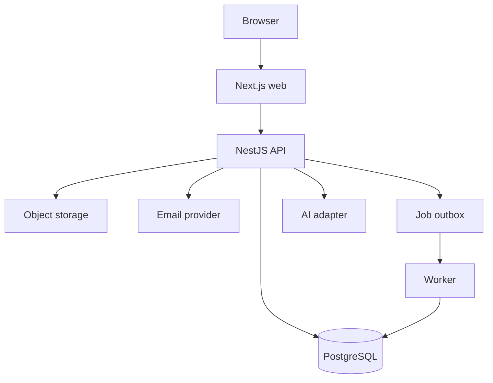

# V1 Software Architecture

- **Owner:** Architecture Owner
- **Status:** In Review
- **Version:** 0.2
- **Last Updated:** 2026-07-25
- **Applies To:** Backend, frontend, data, security, infrastructure and delivery

**Revision Note (0.2):** ADR-0010–ADR-0014 were accepted as v1.0 and the exact architecture package passed Final Review. No technical behavior was added or removed.

## 1. Decision Summary

V1 is implemented as a TypeScript monorepo containing three independently deployable processes:

1. `web` — Next.js public, account, Business and Admin experiences;
2. `api` — NestJS modular-monolith HTTP API;
3. `worker` — NestJS background jobs using the same application modules without serving public HTTP.

PostgreSQL is the system of record. Redis is not mandatory for first release; it is introduced only when a measured caching, rate-limit or job-throughput need exists. Search starts with a PostgreSQL search projection and indexed full-text/trigram matching. Object storage holds uploaded media. Decision Chat uses an application-owned interface with a replaceable AI-provider adapter.

## 2. Architecture Drivers

- ship the Frozen V1 scope within thirty days;
- preserve Universal Offering and Attribute Engine rules;
- support Mobility, Real Estate and Technology without category-specific code paths;
- keep Business as a User-owned profile, not an identity;
- support Guest, User, Business-context and Admin-context access;
- make moderation and Affiliate Destination state changes auditable;
- keep Decision Chat assistive, contextual and non-autonomous;
- allow later extraction of high-load modules without paying microservice cost in V1.

## 3. System Context

| Actor/System | Interaction |
|---|---|
| Guest/User browser | HTTPS to web and API |
| Business-context User | Manages Business, Offerings and Affiliate Destinations through API |
| Admin-authorized User | Uses Admin routes and governed commands |
| AI provider | Receives minimized Decision Context through server-side adapter |
| Email provider | Verification and password-recovery messages |
| Object storage | Offering and Business media |
| Affiliate destination | External browser handoff; never receives platform secrets |

## 4. Runtime Topology

## 5. Backend Module Boundaries

| Module | Owns | May consume |
|---|---|---|
| Identity | User Account, credentials/session linkage, access status | Audit |
| Business | Business Profile, ownership, contact information, moderation input | Identity |
| Catalog | Domain, Category, Attribute Definition | Audit |
| Offering | Offering, attribute values, publication and Affiliate Destination | Business, Catalog |
| Discovery | Search projection, browse/filter query model, result ordering | Offering eligibility output |
| Decision | Comparison Set, Decision Context, chat session, selection and completion | Discovery and Offering read models |
| Moderation | Moderation Case, correction and governed Admin actions | Identity, Business, Offering |
| Analytics | approved V1 counters and activity facts | domain events |
| Platform | Admin-context orchestration and action queues | all permitted application services |
| Audit | immutable security and business-action evidence | actor/context metadata |

Modules communicate through public application interfaces and domain events. A module must not write another module's tables.

## 6. Request and Command Pattern

- Browser calls versioned JSON endpoints under `/api/v1`.
- Controllers validate transport input and call application commands/queries.
- Commands perform authorization inside the application boundary, execute one transaction and emit domain events through an outbox.
- Queries use dedicated read services and may use optimized projections.
- External side effects are executed by the worker after transaction commit.
- Every mutation accepts or generates a correlation ID.
- Retryable public mutations use idempotency keys where duplicate side effects are possible.

## 7. Key End-to-End Flows

### 7.1 Publish Offering

Business-context authorization → validate Universal Publication Minimum → validate category/attributes → calculate public eligibility → commit Offering state and outbox event → refresh Discovery projection → public query becomes eligible.

### 7.2 Discovery

Parse query and category context → obtain active filter definitions → query only publicly eligible search projection → apply deterministic recency ordering and pagination → return listing-card projection.

### 7.3 Decision

Open eligible Offering(s) → create or update bounded Comparison Set → construct minimized Decision Context → optionally request assistive chat response → User explicitly selects or initiates approved handoff → record completion fact.

### 7.4 Moderation

Admin-context authorization → open/retrieve Moderation Case → issue governed command → target module applies owned state transition → Audit records actor, reason and before/after identifiers → affected projections refresh.

## 8. API Standards

- REST/JSON for V1; no public GraphQL layer.
- OpenAPI generated and contract-tested.
- resource identifiers are opaque UUIDs;
- cursor pagination for public lists; bounded offset pagination permitted for Admin V1 lists;
- ISO-8601 UTC timestamps;
- structured error envelope: `code`, `message`, `fieldErrors`, `correlationId`;
- optimistic concurrency token on high-conflict Admin and Business mutations;
- no internal exception, SQL or provider response exposed to clients.

## 9. Quality Attributes

| Attribute | V1 target |
|---|---|
| Availability | deployment supports health checks and rollback; numeric SLO set before production gate |
| Performance | public read paths measured under representative load; no unbounded queries |
| Security | server-side authorization on every protected command/query |
| Privacy | minimized AI and analytics payloads; retention documented before launch |
| Reliability | transactional outbox for committed side effects; idempotent workers |
| Accessibility | WCAG 2.2 AA target for critical flows |
| Observability | structured logs, metrics, traces/correlation and actionable alerts |
| Recoverability | automated backups plus tested restore before production release |

## 10. Explicit Non-Goals

- microservices, Kubernetes, event streaming platform or service mesh;
- payments, logistics, inventory, enterprise procurement or external API marketplace;
- autonomous agents or long-term Decision Memory;
- a dedicated search cluster before PostgreSQL search limits are measured;
- native mobile applications in V1;
- multi-region active-active operation.

## 11. Implementation Sequence

1. repository and CI skeleton;
2. Identity and authorization baseline;
3. Catalog, Business and Offering write model;
4. public eligibility and Discovery projection;
5. public web: Home, Discovery and Offering Detail;
6. Compare and Decision flow;
7. Business dashboard;
8. Admin moderation and configuration;
9. analytics, hardening, recovery and release evidence.

## 12. Gate

Implementation may begin only after the ADR-required decisions in `V1_ARCHITECTURE_ADR_ASSESSMENT.md` are accepted or explicitly changed by the Architecture Owner.
